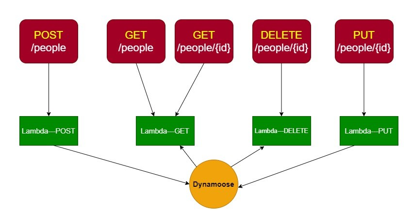

# serverless-api

### What is the root URL to your API?

#### [https://dq311hp0p5.execute-api.us-east-1.amazonaws.com/](https://dq311hp0p5.execute-api.us-east-1.amazonaws.com/)

### What are the routes?

#### /people : for get all records, and add by post.

#### /people/{id} : for get, update, and delete one record.

## POST method : add one record

- [https://dq311hp0p5.execute-api.us-east-1.amazonaws.com/people](https://dq311hp0p5.execute-api.us-east-1.amazonaws.com/people)

- request.body should be :

```
{
"name":"alaa",
"gender":"male",
"age":26,
"nationality":"Jordainian"
}
```

- respnse data shuold be like this :

```
{"id":"95abdb97-4bac-4831-a546-9b70f0353d36","name":"alaa","gender":"male","age":26,"nationality":"Jordainian"}
```

## GET method : get All records

- [https://dq311hp0p5.execute-api.us-east-1.amazonaws.com/people](https://dq311hp0p5.execute-api.us-east-1.amazonaws.com/people)

- respnse data shuold be like this :

```
[{"nationality":"Jordainian","id":"2139934f-c190-4c16-a34d-af9843c47f00","name":"Omar","gender":"male","age":18},{"nationality":"Jordainian","id":"95abdb97-4bac-4831-a546-9b70f0353d36","name":"alaa","gender":"male","age":26},{"nationality":"Jordainian","id":"d10a2a53-499a-40bf-ae99-e377d78bd288","name":"Lama","gender":"female","age":22}]
```

## GET method : get one record

- [https://dq311hp0p5.execute-api.us-east-1.amazonaws.com/people](https://dq311hp0p5.execute-api.us-east-1.amazonaws.com/people/d10a2a53-499a-40bf-ae99-e377d78bd288)

- respnse data shuold be like this :

```
{"nationality":"Jordainian","id":"d10a2a53-499a-40bf-ae99-e377d78bd288","name":"Lama","gender":"female","age":22}
```

## DELETE method : delete one record

- [https://dq311hp0p5.execute-api.us-east-1.amazonaws.com/people](https://dq311hp0p5.execute-api.us-east-1.amazonaws.com/people/d10a2a53-499a-40bf-ae99-e377d78bd288)

- respnse data shuold be like this :

```
{}
```

## PUT method : update record data

- [https://dq311hp0p5.execute-api.us-east-1.amazonaws.com/people](https://dq311hp0p5.execute-api.us-east-1.amazonaws.com/people/d10a2a53-499a-40bf-ae99-e377d78bd288)

- respnse data shuold be like this :

```
{"nationality":"Jordainian","id":"d10a2a53-499a-40bf-ae99-e377d78bd288","name":"Lama-Updated","gender":"female","age":22}
```

# UML


